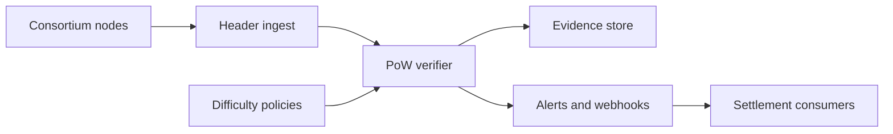

# Noncegate

**Source:** `ai-in-decentralized+ai/proof-of-work/`
**Domain:** `ai-decentralized`
**One-liner:** An operations control plane that configures PoW difficulty, verifies block nonces against chain rules, and flags rewrite attempts so consortium operators can prove mining is hard and cheating is expensive.
**Wedge:** Enterprise and consortium chain operators (settlement, provenance, multi-party audit ledgers) that still use PoW or hybrid PoW for append resistance and need auditor-ready evidence — not crypto-native mining farms.
**Positioning:** The source’s teaching core is simple and durable: mining must be challenging; the nonce must bind block data and prior hash; others must verify easily; rewriting history forces recomputation of all subsequent work while honest parties only extend one tip. Noncegate productises that assurance as policy, monitoring, and evidence — not a new coin.

## Market research synthesis

### Thesis from source

The PoW briefing states that blocks should be hard to produce and easy to check. Miners search for a nonce such that the hash of transactions + previous hash + nonce meets a difficulty target (e.g. leading zeros). Difficulty is the lever that controls issuance/pace. Cheating by altering a past block invalidates that block’s PoW and every successor’s, imposing recomputation cost; honest miners only need to mine the next tip. For AI/decentralized-data networks that still rely on PoW-style availability or dedicated PoW sidechains (as referenced across the broader Ocean technical corpus), the operational gap is that teams treat difficulty as a tribal constant and verification as “the node software handles it,” leaving auditors without a business-facing control plane. Noncegate makes difficulty policy, nonce verification outcomes, and rewrite-cost estimates first-class business objects.

### Buyer & economic model

- **Primary buyer:** Blockchain/platform engineering lead or Chief Security Officer for a consortium ledger.
- **Users:** node operators, security auditors, compliance officers, token/treasury stewards (if issuance linked to difficulty).
- **Budget owner / value metric:** integrity and audit budget. Value metric is % blocks with independent Noncegate verification pass and mean time to detect difficulty or history anomalies.
- **Competing status quo:** raw node RPCs, manual log greps, reliance on a single client implementation, no business SLA on rewrite resistance.

### Domain constraints

- **Regulatory / trust / safety:** auditors need explainable evidence; energy/difficulty ethics for public chains; private consortia still need anti-rewrite guarantees.
- **Data sensitivity:** transaction payloads may be confidential — verifiers need headers/nonces without full business data where possible.
- **Change-management realities:** difficulty changes are politically sensitive; must be scheduled, signed, and reversible only via governance.

## Business requirements

- BR-1: Operators must set and version difficulty targets with effective timestamps and dual-control approval.
- BR-2: Every accepted block must be independently re-verified for nonce validity against declared difficulty and parent hash.
- BR-3: Attempts to present an alternate history must surface a recomputation-cost estimate relative to the honest tip.
- BR-4: Verification must be cheap relative to mining — SLA for verify latency vs mine time ratio.
- BR-5: Anomalies (invalid nonce, difficulty mismatch, sudden hash-rate cliffs) must open actionable alerts with severity.
- BR-6: Audit exports must show policy versions, verification results, and alert resolutions for a period.
- BR-7: Confidential ledgers must support header-only verification modes.
- BR-8: Difficulty controls must not be changeable by a single operator identity.
- BR-9: Integration must work alongside existing node clients without replacing consensus code paths initially.
- BR-10: Dashboards must show honest tip vs candidate forks with work differential.
- BR-11: Retention of verification evidence must meet the consortium’s audit window.
- BR-12: Failed verifications must be able to gate downstream settlement consumers via webhook/API.

## User stories

Canonical user stories live in sibling [USER_STORIES.md](USER_STORIES.md).

## System design

### Overview

Noncegate sits beside consortium nodes. It ingests block headers (and optionally bodies), verifies PoW against the active difficulty policy, records results, compares candidate tips by cumulative work, and emits alerts/webhooks. Difficulty policies are versioned under dual control. Audit packs export the evidence trail.

### Actors & boundaries

- **Actors:** operator, auditor, compliance, settlement consumer, node infrastructure.
- **Trust boundary:** Noncegate trusts cryptographic verification, not operator assertions about “valid blocks.” Nodes remain consensus engines; Noncegate is the assurance and policy plane.
- **Human-in-the-loop points:** difficulty approvals; alert acknowledgement; fork incident response.

### Core capabilities

1. **Difficulty policy management** — versioned, dual-control.
2. **Nonce verification** — independent PoW checks.
3. **Fork / rewrite analysis** — cumulative work differentials.
4. **Alerting** — invalid work, policy drift, hash-rate shocks.
5. **Downstream gating webhooks** — settlement consumers.
6. **Audit export** — evidence packs.
7. **Header-only mode** — confidential chains.
8. **Operator identity & dual control** — change governance.

### Conceptual data

- **Primary entities:** DifficultyPolicy, BlockObservation, VerificationResult, ForkReport, Alert, AuditPack, OperatorApproval.
- **Critical events:** policy approved, block verified/failed, fork detected, alert opened/closed, webhook emitted.
- **Retention / audit needs:** verification results and policies retained for full consortium audit window.

### Integrations (conceptual)

- **Systems of record:** node RPC/WS feeds, SIEM, settlement engines, GRC tools.
- **Upstream signals:** peer headers, hash-rate estimators.
- **Downstream actions:** webhooks, tickets, settlement pauses.

### High-level architecture

### Success metrics

- **Leading:** verification coverage %; verify/mine time ratio; dual-control compliance on policy changes.
- **Lagging:** undetected invalid-block incidents; auditor exceptions; settlement pauses avoided vs incurred.

## OpenAPI

Canonical HTTP surface: one OpenAPI 3.1 YAML per domain under `packages/openapi-core/src/`.

- **Base path:** `/v1/...` (product domains); identity blueprint remains `/v0/...`
- **Auth:** API key and/or Bearer JWT (operator)
- **Domains:** identity, difficulty-policy, block-observation, verification-result, fork-report, alert, audit-pack, webhook
