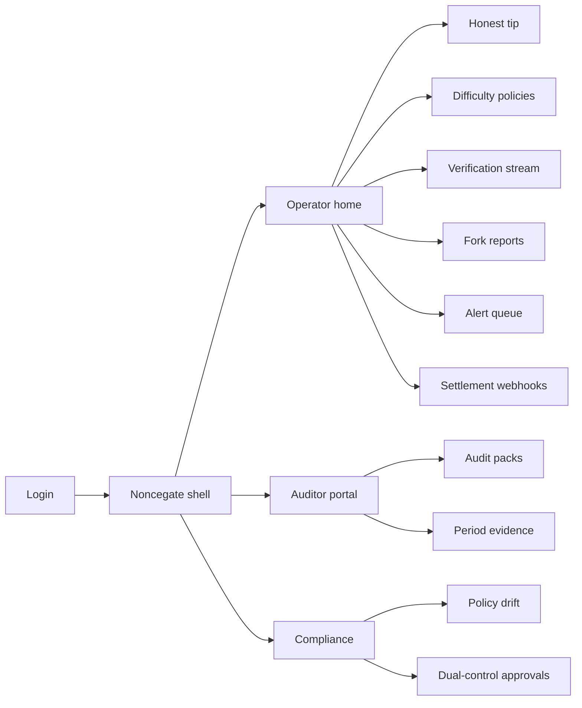
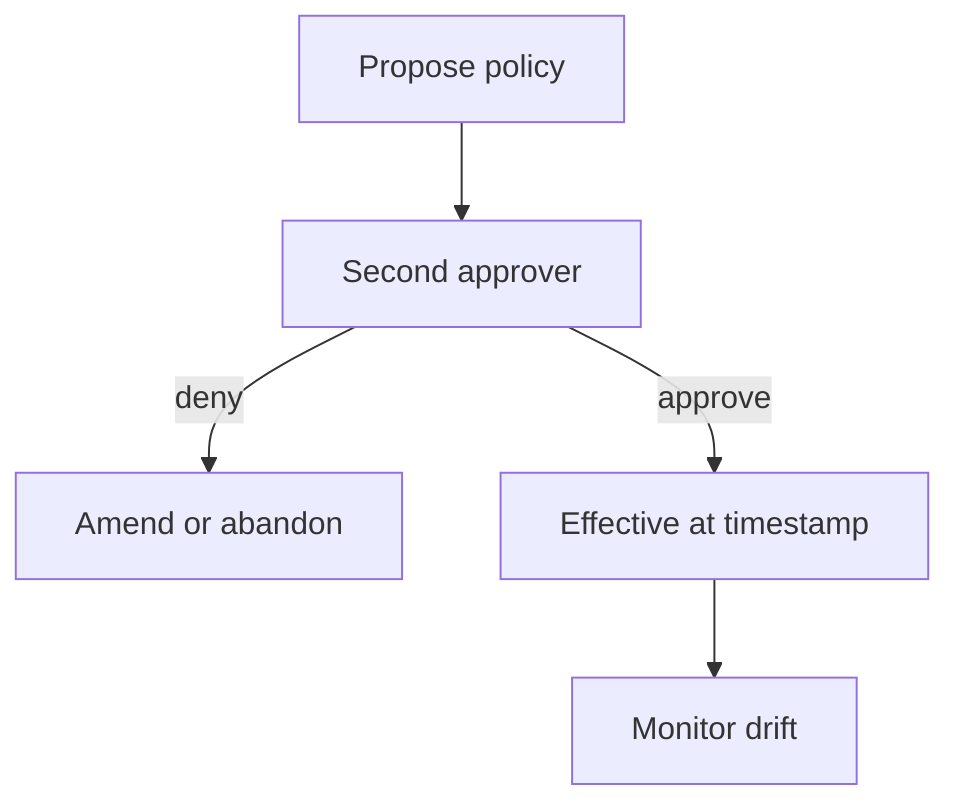
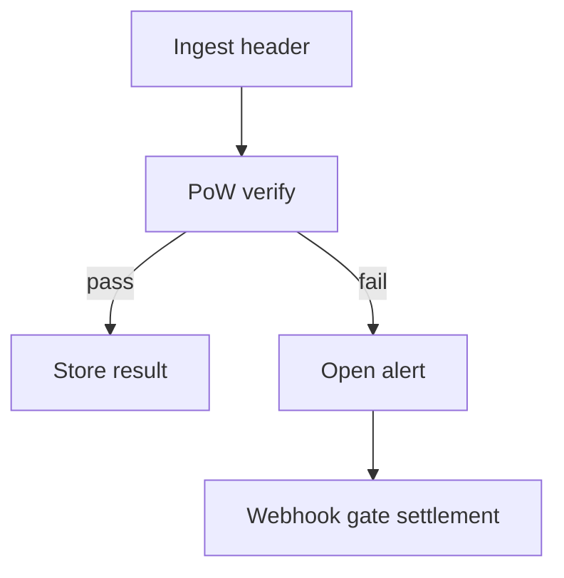

# Noncegate — Web app

**Product:** [PRODUCT.md](./PRODUCT.md)
**Primary surface:** Consortium integrity console for chain operators, security auditors, and compliance
**Secondary surfaces:** Read-only auditor evidence portal; settlement-consumer webhook status board (ops-facing, not a trading desk)
**Design thesis:** Noncegate is a gatehouse for proof-of-work assurance — difficulty policy, nonce verification, and rewrite-cost evidence — not a mining farm dashboard and not a coin wallet. The metaphor is a checkpoint: every block presents papers (header + nonce); the gate stamps pass/fail cheaply; rewriting the past shows the recomputation mountain ahead. Visual language is graphite steel and caution-amber on near-black industrial ground: valid work feels stamped; invalid nonces feel barred; fork differentials feel heavy. The wordmark sits as a quiet gate seal on every evidence-bearing screen so auditors know whose independent check they are citing.

## UX research synthesis

### Category peers (best-in-class)

- **Block explorers (Etherscan / Blockscout) — PoW-era views:** Block header fields, difficulty, nonce, parent hash in scannable detail. Steal: header-first inspection without forcing full tx dumps; reject explorer “token transfer” chrome as the home metaphor.
- **Chainalysis / TRM KYT ops consoles:** Alert queues with severity, case disposition, exportable investigation packs. Steal: actionable anomaly queues and period evidence packs; reject AML entity-graph aesthetics for consortium PoW ops.
- **Datadog / Grafana infrastructure SLOs:** Latency ratio tiles, anomaly detection, webhook routing to consumers. Steal: verify-vs-mine latency SLA and webhook delivery health; reject generic infra host maps as the primary integrity story.
- **AWS Config / cloud audit dual-control patterns:** Versioned policy, dual approval, drift alerts. Steal: dual-control difficulty changes with effective timestamps; reject cloud-resource sprawl UX.

### Patterns to adopt / reject

- **Adopt:** Versioned difficulty policies with dual-control; independent re-verify of every accepted block; fork view with cumulative work differential and recomputation-cost estimate; header-only mode for confidential ledgers; alerts that open cases; webhooks that gate settlement; auditor period packs.
- **Reject:** Hash-rate vanity for retail miners; “mine to earn” wallets; purple AI predictions of 51% attacks; editable verification results; single-admin difficulty toggles; dashboard-of-everything without an honest tip.

### Trust, density, and workflow constraints from PRODUCT.md

Difficulty changes are politically sensitive: scheduled, signed, dual-control, not single-operator (BR-1, BR-8). Every block gets independent nonce verification against difficulty and parent (BR-2). Alternate histories show recomputation cost vs honest tip (BR-3, BR-10). Verify must stay cheap vs mine (BR-4). Anomalies open severity-tagged alerts (BR-5). Audit exports cover policy versions, results, resolutions (BR-6, BR-11). Header-only mode for confidential payloads (BR-7). Sits beside nodes without replacing consensus initially (BR-9). Failed verification can gate settlement consumers (BR-12).

## Information architecture

### Nav model

### Roles → default home

| Role | Default home | Why |
|------|--------------|-----|
| Chain operator | Honest tip + verification coverage | Daily integrity (BR-2, BR-10) |
| Security auditor | Audit packs | Board attestation (BR-6) |
| Compliance officer | Policy drift / dual-control queue | Catch unauthorised difficulty changes (BR-1, BR-8) |
| Settlement owner | Webhook health | Do not clear on unverified tips (BR-12) |
| Node infrastructure | Block observation ingest status | Feed health without owning consensus |

### Cross-links to OpenAPI resources

| Nav area | OpenAPI tags / resources |
|----------|---------------------------|
| Difficulty policy versions | DifficultyPolicies |
| Header ingest / tip | BlockObservations |
| Pass/fail PoW checks | VerificationResults |
| Rewrite cost / forks | ForkReports |
| Anomaly queue | Alerts |
| Period evidence exports | AuditPacks |

## Screen inventory

### Operator home — honest tip

- **Purpose:** Answer “is the tip independently verified, and how does candidate work compare?”
- **Entry:** Operator login default.
- **Layout regions:** Brand seal; honest tip header summary (height, difficulty, nonce status); verification coverage %; verify/mine time ratio; fork differential strip; alert severity rail.
- **Primary actions:** Open failed verifications; open fork report; export snap evidence.
- **Empty / loading / error:** Empty = connect node feed; error = ingest down with request id.
- **BR / story ties:** BR-2, BR-4, BR-10.

### Difficulty policy manager

- **Purpose:** Set and version difficulty targets with effective timestamps and dual-control approval.
- **Entry:** Ops → Policies; compliance approvals shortcut.
- **Layout regions:** Policy version timeline; draft editor (target, schedule); approver A/B status; signed change log; drift vs live network.
- **Primary actions:** Propose change; approve/reject (second identity); schedule; rollback via new version only.
- **Empty / loading / error:** No active policy = blocking banner; single-approver attempt rejected inline.
- **BR / story ties:** BR-1, BR-8; chain operator stories.

### Verification stream

- **Purpose:** Independent re-check of every accepted block’s nonce against declared difficulty and parent hash.
- **Entry:** Ops → Verification; deep link from tip.
- **Layout regions:** Append-only result table (block id, parent, difficulty version, pass/fail, latency); header-only toggle indicator; filter failed; detail drawer with hash preimage fields (no confidential body by default).
- **Primary actions:** Re-verify sample; open alert from fail; export slice.
- **Empty / loading / error:** Stream lag warning; fail rows coral-barred.
- **BR / story ties:** BR-2, BR-4, BR-7.

### Fork and rewrite analysis

- **Purpose:** Show candidate forks vs honest tip with cumulative work differential and recomputation-cost estimate.
- **Entry:** Tip alert; Forks nav.
- **Layout regions:** Fork graph (tips); work differential; recomputation-cost narrative; affected height range; incident notes.
- **Primary actions:** Acknowledge; open alerts; export fork report for auditor.
- **Empty / loading / error:** Empty = “single tip — no competing work”; loading = skeleton graph.
- **BR / story ties:** BR-3, BR-10; auditor rewrite-cost story.

### Alert queue

- **Purpose:** Actionable anomalies — invalid nonce, difficulty mismatch, hash-rate cliffs, policy drift.
- **Entry:** Ops Alerts; compliance drift.
- **Layout regions:** Severity-sorted queue; case detail; related blocks/policies; resolution log; webhook emission status.
- **Primary actions:** Ack; escalate; resolve with note; silence with expiry (audited).
- **Empty / loading / error:** Empty = healthy integrity message; not a blank void.
- **BR / story ties:** BR-5; compliance stories.

### Settlement webhook board

- **Purpose:** Gate downstream settlement consumers when verification fails.
- **Entry:** Settlement owner default; Ops Webhooks.
- **Layout regions:** Consumer endpoints; delivery log; pause-on-fail policy; last gated tip; test emit.
- **Primary actions:** Register webhook; pause/resume consumer; replay event.
- **Empty / loading / error:** No consumers = CTA to register; delivery fail = coral with retry.
- **BR / story ties:** BR-12; settlement owner stories.

### Header-only mode settings

- **Purpose:** Verify without ingesting confidential transaction bodies.
- **Entry:** Ops settings / chain profile.
- **Layout regions:** Mode toggle; fields required for PoW check; redaction proof note for auditors.
- **Primary actions:** Enable header-only; prove sample verification still passes.
- **Empty / loading / error:** Misconfig = cannot verify without required header fields.
- **BR / story ties:** BR-7.

### Auditor evidence portal

- **Purpose:** Period packs of policy versions, verification results, and alert resolutions.
- **Entry:** Auditor login; Ops export.
- **Layout regions:** Period picker; pack checklist; coverage stats; download; hash attestation of pack.
- **Primary actions:** Generate pack; verify hash; share with board/counsel.
- **Empty / loading / error:** Empty period = no observations; retention warning near window edge (BR-11).
- **BR / story ties:** BR-6, BR-11; auditor stories.

### Dual-control approvals inbox

- **Purpose:** Second-identity queue for difficulty proposals.
- **Entry:** Compliance / designated approvers.
- **Layout regions:** Pending proposals; diff vs current; cryptographic/signed identity of proposer; approve/deny.
- **Primary actions:** Approve; deny with reason; request amendment.
- **Empty / loading / error:** Empty = no pending policy changes.
- **BR / story ties:** BR-1, BR-8.

### Node feed health

- **Purpose:** Confirm Noncegate sits beside clients — ingest healthy without claiming to replace consensus.
- **Entry:** Ops secondary; infra role.
- **Layout regions:** RPC/WS feed status; observation lag; client identity labels; non-replacement banner.
- **Primary actions:** Rotate credentials; pause ingest.
- **Empty / loading / error:** Feed down = blocking for verification coverage.
- **BR / story ties:** BR-9.

## Key flows

1. **Dual-control difficulty change** — propose → second identity approves → effective timestamp → network observes new target; failure: single operator blocked (BR-8).

2. **Block verify and gate** — ingest header → verify nonce vs policy → pass append evidence / fail alert + webhook pause settlement.

3. **Fork incident** — detect candidate tip → compute work differential → estimate recomputation cost → auditor pack (BR-3).

4. **Period audit export** — select window → include policies, results, resolutions → hash pack → download (BR-6).

5. **Policy drift alert** — live difficulty ≠ approved version → compliance alert → dual-control remediation.

## Design system

### Tokens (CSS variables)

- `--color-ink: #E6EAF0` — primary text
- `--color-steel-950: #0A0D12` — app ground
- `--color-steel-900: #12171F` — panels
- `--color-steel-700: #2A3340` — rules
- `--color-gate: #7C8C9E` — brand / chrome steel
- `--color-pass: #3D9B6E` — verification pass stamp
- `--color-bar: #D4544A` — invalid nonce / barred
- `--color-caution: #E0A53A` — fork / pending approval
- `--color-mute: #8B95A3` — secondary labels
- `--font-display: "Space Grotesk", sans-serif` — gate titles and tip height
- `--font-body: "IBM Plex Sans", sans-serif`
- `--font-mono: "IBM Plex Mono", monospace` — hashes, nonces, policy ids
- `--space-1`…`--space-8`: 4px scale
- `--radius-sm: 2px`; `--radius-md: 4px` — industrial sharp
- `--motion-stamp: 160ms ease-out` — pass stamp
- `--motion-bar: 140ms ease-in` — fail bar
- `--motion-fork: 260ms ease-in-out` — fork differential draw
- Atmosphere: fine horizontal hatch (checkpoint ledger) on steel-900; cool steel rim — no purple crypto glow, no neon hash rain, no mining-rig stock photos.

### Typography & brand

- Space Grotesk for tip height and screen titles; mono for nonces and hashes.
- Noncegate wordmark on every evidence-bearing view; never “Dashboard” as the strongest mark.
- Login: brand + one headline (“Hard to mine. Easy to check.”) + one CTA.

### Do / don’t

- **Do:** Show honest tip vs forks with work differential; lock verification results as append-only; require dual control chrome on difficulty; label header-only mode clearly.
- **Don’t:** Retail miner earnings tiles; editable pass/fail; purple AI risk scores; pill soup filters; emoji severity.

### Accessibility & domain trust cues

- Pass/fail never colour-only — stamp/bar icons + text.
- Live regions for new fails and fork detections.
- Focus order: tip → failures → forks → policies.
- Audit packs machine-readable for external auditors.

## Component patterns

- **TipHeaderCard** — honest tip fields with verify stamp (interaction container, not vanity card grid).
- **DifficultyVersionTimeline** — dual-control versions with effective timestamps.
- **VerificationResultRow** — pass/fail, latency, policy version, evidence link.
- **ForkWorkDiff** — cumulative work and recomputation-cost estimate.
- **IntegrityAlertCase** — severity, disposition, webhook status.
- **SettlementGateWebhook** — pause-on-fail consumer control.
- **HeaderOnlyBadge** — confidential verification mode.
- **AuditPackExport** — period evidence with content hash.

## Out of scope for v1 web

- Mining pool operator UI; ASIC firmware; public crypto exchange; replacing node consensus clients; consumer wallet; energy-offset marketplace; full SIEM replacement (emit to SIEM only).
